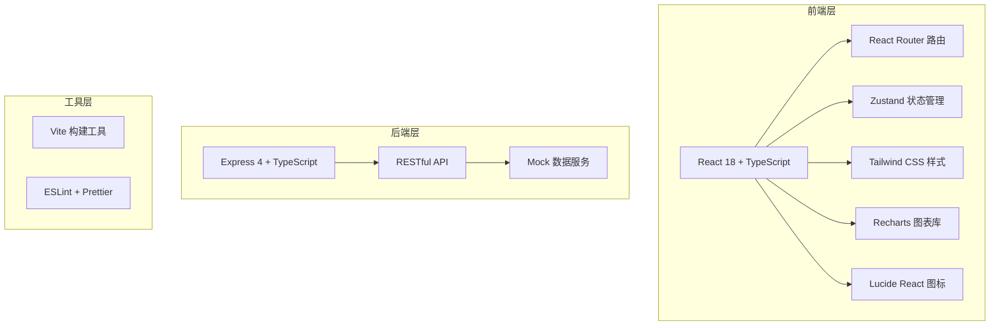
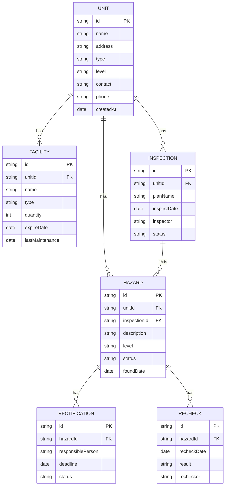

## 1. 架构设计

本项目采用前后端分离架构，前端使用 React + TypeScript + Vite 构建，后端使用 Express + TypeScript 提供 API 服务，数据使用 Mock 数据模拟。



## 2. 技术描述

- **前端框架**: React@18 + TypeScript
- **构建工具**: Vite@5
- **路由管理**: react-router-dom@6
- **状态管理**: zustand@4
- **样式方案**: tailwindcss@3
- **图表库**: recharts@2
- **图标库**: lucide-react@0
- **UI 组件**: 基于 Tailwind CSS 自定义组件
- **后端框架**: Express@4 + TypeScript
- **数据方案**: Mock 数据，无需数据库
- **初始化工具**: vite-init

## 3. 路由定义

| 路由路径 | 页面名称 | 说明 |
|----------|----------|------|
| / | 风险地图 | 首页，展示风险热力图和统计数据 |
| /units | 单位档案 | 重点场所列表和详情管理 |
| /inspections | 检查计划 | 检查表配置和检查计划管理 |
| /hazards | 隐患整改 | 隐患登记、整改和复查管理 |
| /training | 宣传培训 | 培训、考试和演练管理 |
| /reports | 举报受理 | 群众举报登记和处理 |
| /analytics | 数据分析 | 数据统计分析和报表导出 |

## 4. 数据模型

### 4.1 实体关系图



### 4.2 核心数据类型定义

```typescript
// 单位信息
interface Unit {
  id: string;
  name: string;
  address: string;
  type: '商场' | '酒店' | '工厂' | '学校' | '医院' | '住宅小区' | '其他';
  level: '重点' | '一般' | '关注';
  contact: string;
  phone: string;
  area: number;
  floorCount: number;
  establishDate: string;
  createdAt: string;
}

// 消防设施
interface Facility {
  id: string;
  unitId: string;
  name: string;
  type: '灭火器' | '消火栓' | '烟感探测器' | '喷淋系统' | '应急照明' | '疏散指示标志' | '其他';
  quantity: number;
  expireDate: string;
  lastMaintenance: string;
  status: '正常' | '过期' | '维修中' | '缺失';
}

// 检查计划
interface InspectionPlan {
  id: string;
  name: string;
  type: '日常检查' | '专项检查' | '季度检查' | '年度检查';
  startDate: string;
  endDate: string;
  unitIds: string[];
  status: '未开始' | '进行中' | '已完成' | '已逾期';
  createdAt: string;
}

// 检查表
interface CheckList {
  id: string;
  name: string;
  items: CheckItem[];
  createdAt: string;
}

interface CheckItem {
  id: string;
  question: string;
  type: 'single' | 'multiple' | 'text';
  options?: string[];
  required: boolean;
}

// 隐患记录
interface Hazard {
  id: string;
  unitId: string;
  inspectionId?: string;
  description: string;
  location: string;
  level: '一般' | '较大' | '重大';
  images: string[];
  status: '待整改' | '整改中' | '待复查' | '已完成' | '已逾期';
  foundDate: string;
  deadline: string;
  responsiblePerson: string;
  responsiblePhone: string;
  rectificationDescription?: string;
  rectificationImages?: string[];
  recheckDate?: string;
  recheckResult?: '通过' | '不通过';
  rechecker?: string;
}

// 举报记录
interface Report {
  id: string;
  title: string;
  reporterName?: string;
  reporterPhone?: string;
  location: string;
  description: string;
  images: string[];
  status: '待受理' | '处理中' | '已处理' | '已结案';
  handler?: string;
  handleResult?: string;
  createdAt: string;
  updatedAt: string;
}

// 培训记录
interface Training {
  id: string;
  title: string;
  type: '消防知识培训' | '应急演练' | '技能培训';
  date: string;
  location: string;
  participants: number;
  duration: number;
  materials?: string[];
  attendeeList: string[];
  createdAt: string;
}

// 考试记录
interface Exam {
  id: string;
  title: string;
  trainingId?: string;
  questions: ExamQuestion[];
  passScore: number;
  createdAt: string;
}

interface ExamQuestion {
  id: string;
  question: string;
  type: 'single' | 'multiple' | 'judge';
  options: string[];
  correctAnswer: string | string[];
  score: number;
}

// 用户
interface User {
  id: string;
  name: string;
  role: 'fire_officer' | 'property_manager' | 'fire_supervisor';
  phone: string;
  department?: string;
  avatar?: string;
}
```

## 5. 目录结构

```
├── src/                      # 前端源码目录
│   ├── components/           # 公共组件
│   │   ├── layout/          # 布局组件
│   │   │   ├── Sidebar.tsx
│   │   │   ├── Header.tsx
│   │   │   └── index.tsx
│   │   ├── common/          # 通用组件
│   │   │   ├── Card.tsx
│   │   │   ├── Table.tsx
│   │   │   ├── StatusTag.tsx
│   │   │   └── Modal.tsx
│   │   └── charts/          # 图表组件
│   │       ├── BarChart.tsx
│   │       ├── PieChart.tsx
│   │       └── LineChart.tsx
│   ├── pages/               # 页面组件
│   │   ├── RiskMap/         # 风险地图
│   │   ├── Units/           # 单位档案
│   │   ├── Inspections/     # 检查计划
│   │   ├── Hazards/         # 隐患整改
│   │   ├── Training/        # 宣传培训
│   │   ├── Reports/         # 举报受理
│   │   └── Analytics/       # 数据分析
│   ├── hooks/               # 自定义 Hooks
│   │   └── useMockData.ts
│   ├── store/               # 状态管理
│   │   └── index.ts
│   ├── types/               # TypeScript 类型定义
│   │   └── index.ts
│   ├── utils/               # 工具函数
│   │   └── mock.ts
│   ├── App.tsx
│   ├── main.tsx
│   └── index.css
├── api/                     # 后端 API（可选）
│   └── index.ts
├── public/                  # 静态资源
├── .trae/
│   └── documents/           # 项目文档
├── package.json
├── tsconfig.json
├── vite.config.ts
├── tailwind.config.js
└── postcss.config.js
```
